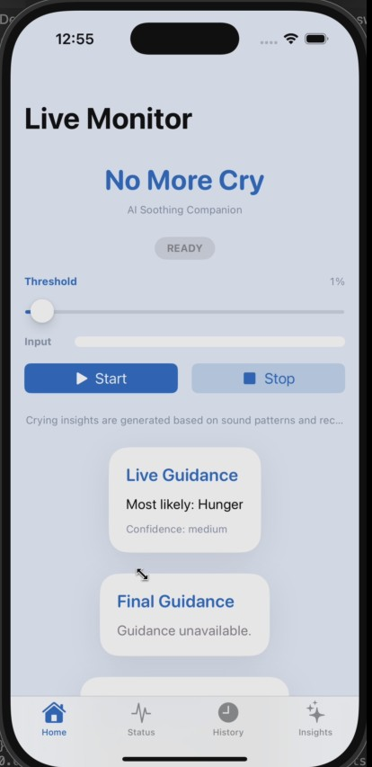
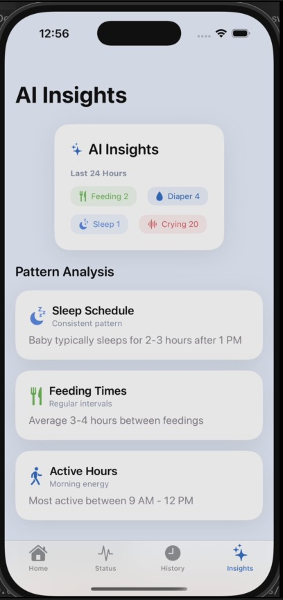
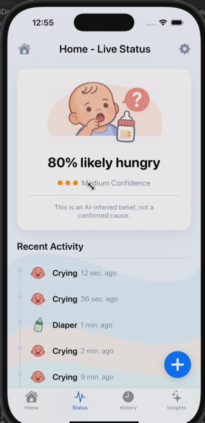

# WhyMyBabyCries_Agent

 This Gemini 3 hackathon project uses multimodal crying analysis plus recent care context to deliver actionable, low-anxiety guidance for new parents. The goal is to help caregivers soothe faster, rest more, and worry less.

**Demo Video**
- Public link: [YouTube Shorts](https://youtube.com/shorts/dPlRg4Gif98?feature=share)
- Local file: `Demo/WhyMyBabyCries_APP_Demo.mov`
- Clickable link: [Demo video (local)](Demo/WhyMyBabyCries_APP_Demo.mov)

<p align="center">
  <a href="https://youtube.com/shorts/dPlRg4Gif98?feature=share">
    
  </a>
</p>

---

**Background Story**
One of us is a first-time dad. There is so much joy, but also many nights of being jolted awake by a baby’s back-to-back cries and the constant worry that something might be wrong. The parents take turns holding, feeding, and changing diapers, yet still guess the cause wrong and feel more anxious with every guess. We wanted a system that feels like an experienced caregiver assistant: not just “maybe hungry,” but a clear next action based on recent feeding, sleep, and diaper history. When evidence is limited, it should say so explicitly. The outcome we care about most is giving parents a calm, effective loop so they can care with confidence and reclaim rest.

---

**Core Features**
- Multimodal crying analysis: upload audio or record live to get transcription + cause probabilities.
- Contextual reasoning: fuses last 24 hours of feeding/diaper/sleep to guide the next action.
- Low-latency live hints: streaming chunks return partial guidance every 3 chunks.
- Feedback learning: helpful/unhelpful feedback updates day/night priors.
- Safe and explainable: confidence level, alternatives, and caregiver notices (no medical diagnosis).

---

**How To Run (Backend)**
```bash
cd backend
python app.py
```

**Environment Variables (`backend/.env`)**
```
GEMINI_API_KEY=your_key_here
GEMINI_API_ENDPOINT=your_endpoint_here
AB_AUTO_SPLIT=false
```

---

**How To Run (Frontend iOS Demo)**
1. Open `frontend/uiDemo/BabyCareUI.xcodeproj` in Xcode.
2. Set `API_BASE_URL` in `frontend/uiDemo/BabyCareUI/Info.plist` if your backend is not at `http://localhost:8000`.
3. Build and run on a simulator or device (microphone permission required for live recording).

---

**Gemini 3 Integration **
This project uses Gemini 3 as the core reasoning engine for “crying audio + care context” multimodal analysis. When a crying event arrives, the backend sends Gemini 3 a structured context payload (recent feeding/diaper/sleep timestamps, recent AI guidance, and learned caregiver feedback priors) together with the audio as `inlineData`. We enforce a strict JSON output contract so Gemini 3 returns exactly two top-level objects: `audio_analysis` (transcription plus cause probability distribution) and `ai_guidance` (most likely cause, alternatives, recommended actions, and caregiver notice).

To reduce caregiver anxiety, the live recording mode streams audio in chunks and requests partial Gemini 3 reasoning every 3 chunks, producing low-latency hints before the final result. When recent context is insufficient, the system includes an uncertainty note rather than over-confident advice. We also write caregiver feedback (helpful/unhelpful) into day/night prior distributions and blend those priors into subsequent reasoning. In short, Gemini 3’s multimodal understanding and structured reasoning are the application’s core, turning raw crying audio into explainable, actionable guidance.

---

**Demo Flow**
1. Record a crying clip (or use live recording).
2. Trigger reasoning and review “most likely cause + next action.”
3. Mark feedback and observe metrics (helpful rate / resolved time).

---

**Sample Audio (For Quick Testing)**
- Local file: `Demo/BabyCries_Test.m4a`
- Clickable link: [Sample cry audio (local)](Demo/BabyCries_Test.m4a)
- Example request:
```bash
curl -X POST http://localhost:8000/api/events/crying \
  -F "occurred_at=2026-02-08T10:02:00Z" \
  -F "audio=@Demo/BabyCries_Test.m4a"
```

---

**Screenshots**
<table align="center">
  <tr>
    <th>Screen</th>
    <th>Preview</th>
  </tr>
  <tr>
    <td>Home</td>
    <td></td>
  </tr>
  <tr>
    <td>Insights</td>
    <td></td>
  </tr>
  <tr>
    <td>Status</td>
    <td></td>
  </tr>
</table>

---

**Project Structure (Brief)**
- `backend/`: API, reasoning engine, A/B and feedback learning.
- `frontend/`: iOS demo app.

---

**Submission (Fill In)**
- Public demo video: `https://youtube.com/shorts/dPlRg4Gif98?feature=share`
- Public code repo: `<your_repo_url>`
